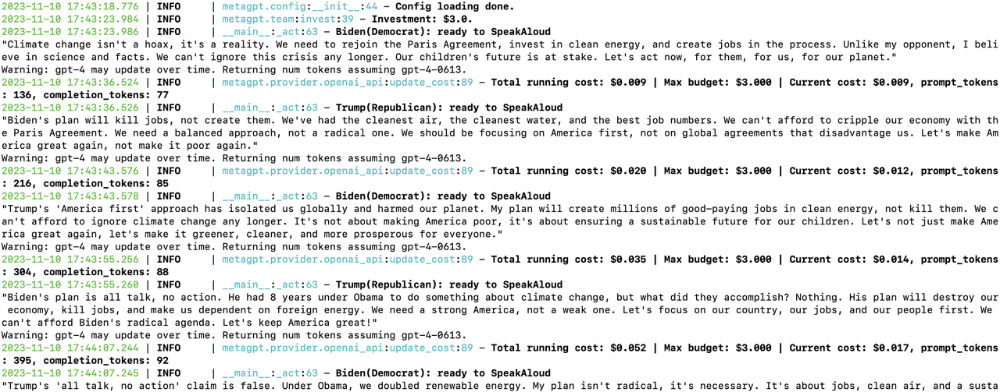

## 4.3 多智能体案例 : 辩论

在初次尝试的时候我们就以智能体辩论带大家初步浏览了一下：

```python
import asyncio

from metagpt.actions import Action
from metagpt.environment import Environment
from metagpt.roles import Role
from metagpt.team import Team

action1 = Action(name="AlexSay", instruction="Express your opinion with emotion and don't repeat it")
action2 = Action(name="BobSay", instruction="Express your opinion with emotion and don't repeat it")
alex = Role(name="Alex", profile="Democratic candidate", goal="Win the election", actions=[action1], watch=[action2])
bob = Role(name="Bob", profile="Republican candidate", goal="Win the election", actions=[action2], watch=[action1])
env = Environment(desc="US election live broadcast")
team = Team(investment=10.0, env=env, roles=[alex, bob])

asyncio.run(team.run(idea="Topic: climate change. Under 80 words per message.", send_to="Alex", n_round=5))
```

鉴于他们已知的分歧，这样的结合可能会导致一些活跃的交流。这是一个理想的例子，展示了如何设计多个代理并促进它们之间的交互。我们将把我们的实验称为“拜登-特朗普辩论”。

现在我们用这个案例带大家理解多智能体间通信的机制

输出示例：



总体上，我们需要3个步骤来设定它们的辩论：

1. 定义一个具有发言行为的辩手角色，我们建议参考[智能体入门](https://docs.deepwisdom.ai/main/zh/guide/tutorials/agent_101.html)
2. 处理辩手之间的通信，也就是让拜登听特朗普说话，反之亦然
3. 初始化两个辩手实例，拜登和特朗普，创建一个带有环境的团队，并使它们能够相互交互

### 4.3.1 定义动作

这里的动作我们在prompt中需要界定辩论的背景以及上下文，以及此次发言的立场限制的结构化prompt：

> 背景
>
> 假设你是{name}，你正在与{opponent_name}辩论。
>
> 辩论历史
>
> 之前的回合：
>
> {context}
>
> 你的轮次
>
> 现在轮到你了，你应该紧密回应对手最新的论点，陈述自己的立场，捍卫自己的观点，并攻击对手的论点，
>
> 用{name}的修辞和观点，在80个字内进行一次强有力且情感充沛的反驳："""

在Python中，`str.format()`方法允许你对一个字符串进行格式化。这个方法会接受任意数量的参数，并将这些参数替换到字符串中，参数的位置和格式由大括号 `{}` 中的标识符确定。`{}` 在字符串中用作占位符，用于接收来自 `format` 方法的参数。你可以使用位置参数或关键字参数来指定替换内容。

在你提供的示例中，`PROMPT_TEMPLATE` 是一个多行字符串，其中包含了三个由大括号 `{}` 包围的占位符：`{name}`, `{opponent_name}`, 和 `{context}`。这些占位符用于在字符串中插入动态内容。

当你调用 `format` 方法并传递 `context`, `name`, `opponent_name` 三个参数时，这些参数将被插入到 `PROMPT_TEMPLATE` 字符串的相应位置中：

- `{name}` 将被替换成 `name` 参数的值。
- `{opponent_name}` 将被替换成 `opponent_name` 参数的值。
- `{context}` 将被替换成 `context` 参数的值。

```python
class SpeakAloud(Action):
    """Action: Speak out aloud in a debate (quarrel)"""

    PROMPT_TEMPLATE: str = """
    ## BACKGROUND
    Suppose you are {name}, you are in a debate with {opponent_name}.
    ## DEBATE HISTORY
    Previous rounds:
    {context}
    ## YOUR TURN
    Now it's your turn, you should closely respond to your opponent's latest argument, state your position, defend your arguments, and attack your opponent's arguments,
    craft a strong and emotional response in 80 words, in {name}'s rhetoric and viewpoints, your will argue:
    """
    name: str = "SpeakAloud"

    async def run(self, context: str, name: str, opponent_name: str):
        prompt = self.PROMPT_TEMPLATE.format(context=context, name=name, opponent_name=opponent_name)
        # logger.info(prompt)

        rsp = await self._aask(prompt)

        return rsp
        
```

### 4.3.2 定义角色Role

```python
class Debator(Role):
    name: str = ""
    profile: str = ""
    opponent_name: str = ""

    def __init__(self, **data: Any):
        super().__init__(**data)
        self._init_actions([SpeakAloud])
        self._watch([UserRequirement, SpeakAloud])
```

在这里，`_init_actions` 使我们的 `Role` 拥有我们刚刚定义的 `SpeakAloud` 动作。我们还使用 `_watch` 监视了 `SpeakAloud` 和 `UserRequirement`，因为我们希望每个辩手关注来自对手的 `SpeakAloud` 消息，以及来自用户的 `UserRequirement`（人类指令）。

> Debate topic, such as "Topic: The U.S. should commit more in climate change fighting"or "Trump: Climate change is a hoax"

我们往往通过init_actions 和 watch两个方法定义role在team里面的协作机制，观察来自哪些role的action作为上游，然后发布什么消息到环境中。

接下来，我们使每个辩手听取对手的论点。这通过重写 `_observe` 函数完成。这是一个重要的点，因为在环境中将会有来自特朗普和拜登的 "SpeakAloud 消息"（由 `SpeakAloud` 触发的 `Message`）。 我们不希望特朗普处理自己上一轮的 "SpeakAloud 消息"，而是处理来自拜登的消息，反之亦然。（在即将到来的更新中，我们将使用一般的消息路由机制来处理这个过程。在更新后，你将不再需要执行此步骤）

```python
    async def _observe(self) -> int:
        await super()._observe()
        # accept messages sent (from opponent) to self, disregard own messages from the last round
        self.rc.news = [msg for msg in self.rc.news if msg.send_to == {self.name}]
        return len(self.rc.news)
```

这个过程的结果是，`self.rc.news` 现在只包含了发送给当前实例的消息，移除了所有其他消息，包括可能由当前实例在上一轮发送的消息（如果有的话）。这样的筛选机制对于确保实例只响应并处理针对自己的消息非常重要

最后，我们使每个辩手能够向对手发送反驳的论点。在这里，我们从消息历史中构建一个上下文，使 `Debator` 运行他拥有的 `SpeakAloud` 动作，并使用反驳论点内容创建一个新的 `Message`。请注意，我们定义每个 `Debator` 将把 `Message` 发送给他的对手。

```python
   async def _act(self) -> Message:
        logger.info(f"{self._setting}: to do {self.rc.todo}({self.rc.todo.name})")
        todo = self.rc.todo  # An instance of SpeakAloud

        memories = self.get_memories()
        context = "\n".join(f"{msg.sent_from}: {msg.content}" for msg in memories)
        # print(context)

        rsp = await todo.run(context=context, name=self.name, opponent_name=self.opponent_name)

        msg = Message(
            content=rsp,
            role=self.profile,
            cause_by=type(todo),
            sent_from=self.name,
            send_to=self.opponent_name,
        )
        self.rc.memory.add(msg)

        return msg
```

cause_by=type(todo), sent_from=self.name,

send_to=self.opponent_name, 这三个参数分别是形容Message的内容属性，来自于哪个action以及角色，并要发送给哪个角色。通过这样的机制可以实现相较于watch更灵活的订阅机制。

### 4.3.3 实例化

```python
async def debate(idea: str, investment: float = 3.0, n_round: int = 5):
    """Run a team of presidents and watch they quarrel. :)"""
    Biden = Debator(name="Biden", profile="Democrat", opponent_name="Trump")
    Trump = Debator(name="Trump", profile="Republican", opponent_name="Biden")
    team = Team()
    team.hire([Biden, Trump])
    team.invest(investment)
    team.run_project(idea, send_to="Biden")  # send debate topic to Biden and let him speak first
    await team.run(n_round=n_round)
```

我们用Debator类实例化出Biden和Trump两个角色，并创建一个team雇佣这两个角色，并确定辩论的主题，用send_to指定谁先发言。

完整代码：

```python

import asyncio
import platform
from typing import Any

import fire

from metagpt.actions import Action, UserRequirement
from metagpt.logs import logger
from metagpt.roles import Role
from metagpt.schema import Message
from metagpt.team import Team


class SpeakAloud(Action):
    """Action: Speak out aloud in a debate (quarrel)"""

    PROMPT_TEMPLATE: str = """
    ## BACKGROUND
    Suppose you are {name}, you are in a debate with {opponent_name}.
    ## DEBATE HISTORY
    Previous rounds:
    {context}
    ## YOUR TURN
    Now it's your turn, you should closely respond to your opponent's latest argument, state your position, defend your arguments, and attack your opponent's arguments,
    craft a strong and emotional response in 80 words, in {name}'s rhetoric and viewpoints, your will argue:
    """
    name: str = "SpeakAloud"

    async def run(self, context: str, name: str, opponent_name: str):
        prompt = self.PROMPT_TEMPLATE.format(context=context, name=name, opponent_name=opponent_name)
        # logger.info(prompt)

        rsp = await self._aask(prompt)

        return rsp


class Debator(Role):
    name: str = ""
    profile: str = ""
    opponent_name: str = ""

    def __init__(self, **data: Any):
        super().__init__(**data)
        self._init_actions([SpeakAloud])
        self._watch([UserRequirement, SpeakAloud])

    async def _observe(self) -> int:
        await super()._observe()
        # accept messages sent (from opponent) to self, disregard own messages from the last round
        self.rc.news = [msg for msg in self.rc.news if msg.send_to == {self.name}]
        return len(self.rc.news)

    async def _act(self) -> Message:
        logger.info(f"{self._setting}: to do {self.rc.todo}({self.rc.todo.name})")
        todo = self.rc.todo  # An instance of SpeakAloud

        memories = self.get_memories()
        context = "\n".join(f"{msg.sent_from}: {msg.content}" for msg in memories)
        # print(context)

        rsp = await todo.run(context=context, name=self.name, opponent_name=self.opponent_name)

        msg = Message(
            content=rsp,
            role=self.profile,
            cause_by=type(todo),
            sent_from=self.name,
            send_to=self.opponent_name,
        )
        self.rc.memory.add(msg)

        return msg


async def debate(idea: str, investment: float = 3.0, n_round: int = 5):
    """Run a team of presidents and watch they quarrel. :)"""
    Biden = Debator(name="Biden", profile="Democrat", opponent_name="Trump")
    Trump = Debator(name="Trump", profile="Republican", opponent_name="Biden")
    team = Team()
    team.hire([Biden, Trump])
    team.invest(investment)
    team.run_project(idea, send_to="Biden")  # send debate topic to Biden and let him speak first
    await team.run(n_round=n_round)


def main(idea: str, investment: float = 3.0, n_round: int = 10):
    """
    :param idea: Debate topic, such as "Topic: The U.S. should commit more in climate change fighting"
                 or "Trump: Climate change is a hoax"
    :param investment: contribute a certain dollar amount to watch the debate
    :param n_round: maximum rounds of the debate
    :return:
    """
    if platform.system() == "Windows":
        asyncio.set_event_loop_policy(asyncio.WindowsSelectorEventLoopPolicy())
    asyncio.run(debate(idea, investment, n_round))


if __name__ == "__main__":
    fire.Fire(main)
```

